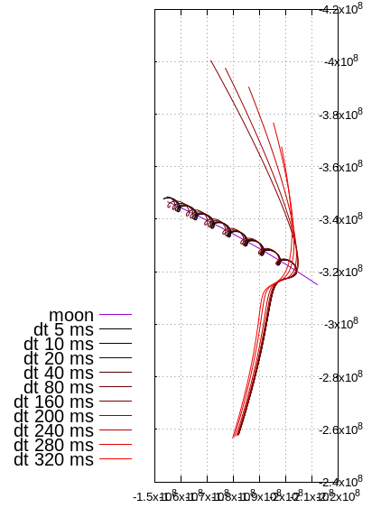

This is a physics simulation of massive bodies under the influence of gravity, written in Common Lisp.
Plots, such as above, are ouput by interfacing with gnuplot with the help of [vgplot](https://github.com/volkers/vgplot).  
Vector mathematics are handled by [3d-vectors](https://github.com/Shinmera/3d-vectors) and [3d-matrices](https://github.com/Shinmera/3d-matrices).
